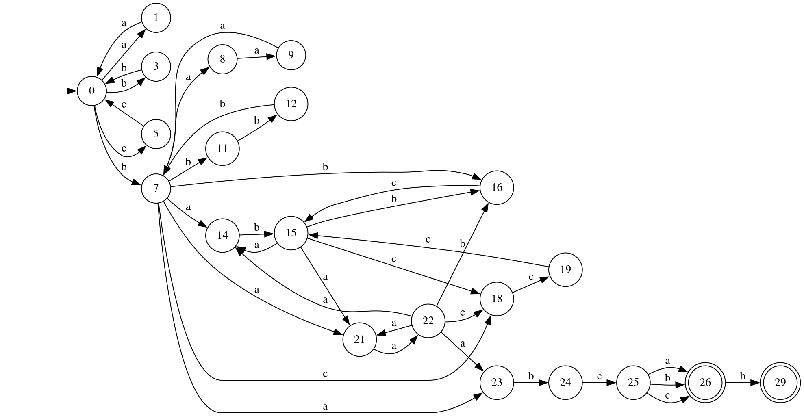

# Лабораторная работа №2

Автор: Лиганкина Анна ИУ9-51Б

## Задание

Дано академическое регулярное выражение:

$$
(aa|bb|cc)^* b(aaa|bbb)^* ((ab|bc|ccc)^* aa)^* abc(a|b|c)(b|\varepsilon)
$$

По нему необходимо построить:

- **минимальный ДКА**, распознающий его язык (минимальность обосновать таблицей классов эквивалентности);

- **возможно малый НКА**, распознающий его язык. Частично обосновать таблицами множеств классов эквивалентности;

- **возможно малый переключающийся (с конъюнкцией) КА**, распознающий его язык. Частично обосновать таблицами множеств классов эквивалентности;

- **расширенное регулярное выражение**, распознающее тот же язык.

Провести автоматическое **тестирование** предполагаемой эквивалентности построенных распознавателей. Тем самым необходимо построить алгоритмы, определяющие принадлежность слова языку академического регулярного выражения, ДКА, НКА и ПКА.

## Реализация

### НКА

Построим НКА при помощи линеаризации исходного регулярного выражения:

$$
    (a_1a_2|b_3b_4|c_5c_6)^* b_7(a_8a_9a_{10}|b_{11}b_{12}b_{13})^*
    ((a_{14}b_{15}|b_{16}c_{17}|c_{18}c_{19}c_{20})^* a_{21}a_{22})^*
    a_{23}b_{24}c_{25}(a_{26}|b_{27}|c_{28})(b_{29}|\varepsilon)
$$

Получившийся автомат в файле `NFA.dot`.

После уменьшения количества состояний возможно малый НКА выглядит так:

Получившийся автомат в файле `NFA_min.dot`.

| q  | Prefix | ε | c | b | cc | bcc | abcc | babcc | aabcc | ababcc | bbabcc | aaabcc | aaaabcc | caaabcc | baaabcc | aababcc | aaaaabcc | baababcc | abaaabcc |
|----|--------|---|---|---|---|---|---|---|---|---|---|---|---|---|---|---|---|---|---|
| 0  | ε      | - | - | - | - | - | - | + | - | - | - | - | - | - | + | + | - | - | - |
| 1  | a      | - | - | - | - | - | - | - | - | + | - | - | - | - | - | - | - | - | + |
| 3  | b      | - | - | - | - | - | - | - | - | - | + | - | - | - | - | - | - | + | - |
| 7  | b      | - | - | - | - | - | + | - | - | - | - | + | + | - | - | - | + | - | + |
| 18 | bc     | - | - | - | - | - | - | - | - | - | - | - | - | - | - | - | - | - | - |
| 23 | ba     | - | - | - | - | + | - | - | - | - | - | - | - | - | - | - | - | - | - |
| 8  | ba     | - | - | - | - | - | - | - | - | - | - | + | - | - | - | - | + | - | - |
| 14 | ba     | - | - | - | - | - | - | - | - | - | - | - | - | - | + | - | - | - | - |
| 21 | ba     | - | - | - | - | - | - | - | + | - | - | - | + | - | - | - | - | - | - |
| 16 | bb     | - | - | - | - | - | - | - | - | - | - | - | - | + | - | - | - | - | - |
| 11 | bb     | - | - | - | - | - | - | - | - | - | + | - | - | - | - | - | - | - | - |
| 24 | bab    | - | - | - | + | - | - | - | - | - | - | - | - | - | - | - | - | - | - |
| 9  | baa    | - | - | - | - | - | - | - | + | - | - | - | + | - | - | - | + | - | - |
| 15 | bab    | - | - | - | - | - | - | - | - | - | - | + | - | - | - | - | + | - | + |
| 22 | baa    | - | - | - | - | - | + | - | - | - | - | + | - | - | - | - | + | - | + |
| 12 | bbb    | - | - | - | - | - | - | + | - | - | - | - | - | - | + | - | - | - | - |
| 25 | babc   | - | + | + | - | - | - | - | - | - | - | - | - | - | - | - | - | - | - |
| 26 | babcc  | + | - | + | - | - | - | - | - | - | - | - | - | - | - | - | - | - | - |
| 29 | babccb | + | - | - | - | - | - | - | - | - | - | - | - | - | - | - | - | - | - |

### ДКА

Детерминизуем и минимизируем возможно малый НКА и получим

Получившийся автомат в файле `DFA_min.dot`.

| q  | prefix       | ε | a | b | ca | bca | abca | aabca | babca | aaabca | ababca | bbabca | aaaabca | aababca | bbbabca | caaabca | baaaabca | ccaaabca | abaaaabca | bbaaaabca | cbaaaabca | aabaaaabca | bbbaaaabca | ccbaaaabca | abbbaaaabca | bccbaaaabca | aabbbaaaabca | aaabbbaaaabca |
|----|--------------|---|---|---|---|---|---|---|---|---|---|---|---|---|---|---|---|---|---|---|---|---|---|---|---|---|---|---|
| 0  | ε            | - | - | - | - | - | - | - | + | - | - | - | - | + | + | - | + | - | - | - | - | + | + | + | - | - | + | - |
| 1  | bcc          | - | - | - | - | - | - | - | - | - | - | - | - | - | - | + | - | - | - | - | - | - | - | - | - | - | - | - |
| 10 | bbbbaaaab    | - | - | - | + | - | + | - | - | + | - | + | + | - | + | + | - | - | - | + | - | - | + | - | - | + | - | + |
| 11 | bb           | - | - | - | - | - | - | - | + | - | - | + | - | + | + | + | + | - | - | + | - | + | + | + | - | - | + | - |
| 12 | bbb          | - | - | - | - | - | + | - | + | + | - | + | + | - | + | - | + | - | - | + | - | - | + | - | - | + | - | + |
| 13 | bbbbaaa      | - | - | - | - | + | + | + | - | + | + | - | + | - | + | - | - | - | + | - | - | - | + | - | + | - | - | + |
| 14 | baaa         | - | - | - | - | + | + | + | - | + | - | - | + | - | + | - | - | - | - | - | - | - | + | - | - | - | - | + |
| 15 | a            | - | - | - | - | - | - | - | - | - | + | - | - | - | - | - | - | - | + | - | - | - | - | - | + | - | - | + |
| 16 | b            | - | - | - | - | - | + | - | - | + | - | + | + | - | + | - | - | - | - | + | - | - | + | - | - | + | - | + |
| 17 | c            | - | - | - | - | - | - | - | - | - | - | - | - | - | - | - | - | - | - | - | + | - | - | - | - | - | - | - |
| 19 | ba           | - | - | - | - | + | - | + | - | + | - | - | + | - | - | - | - | - | - | - | - | - | - | - | - | - | + | - |
| 2  | bccc         | - | - | - | - | - | - | - | - | + | - | - | - | - | - | - | - | - | - | - | - | - | - | - | - | - | - | - |
| 20 | bc           | - | - | - | - | - | - | - | - | - | - | - | - | - | - | - | - | + | - | - | - | - | - | - | - | - | - | - |
| 21 | baba         | - | - | - | - | - | - | + | - | - | - | - | + | - | - | - | - | - | - | - | - | - | - | - | - | - | - | - |
| 22 | babaa        | - | - | - | - | - | + | - | - | + | - | - | - | - | - | - | - | - | - | - | - | - | - | - | - | - | - | - |
| 23 | babaaa       | - | - | - | - | + | - | + | - | - | - | - | + | - | - | - | - | - | - | - | - | - | - | - | - | - | - | - |
| 24 | bab          | - | - | - | + | - | - | - | - | + | - | - | - | - | - | - | - | - | - | - | - | - | - | - | - | - | - | - |
| 25 | babc         | - | + | + | - | - | - | - | - | - | - | - | - | - | - | - | - | + | - | - | - | - | - | - | - | - | - | - |
| 26 | babcab       | + | - | - | - | - | - | - | - | - | - | - | - | - | - | - | - | - | - | - | - | - | - | - | - | - | - | - |
| 27 | bbcc         | - | - | - | - | - | - | - | + | - | - | - | - | + | + | - | + | + | - | - | - | + | + | + | - | - | + | - |
| 28 | bbccc        | - | - | - | - | - | - | - | - | - | - | - | - | - | - | + | - | - | - | - | + | - | - | - | - | - | - | - |
| 29 | bbcccc       | - | - | - | - | - | - | - | + | + | - | - | - | + | + | - | + | - | - | - | - | + | + | + | - | - | + | - |
| 3  | babca        | + | - | + | - | - | - | - | - | - | - | - | - | - | - | - | - | - | - | - | - | - | - | - | - | - | - | - |
| 30 | bbcccca      | - | - | - | - | - | - | + | - | - | + | - | + | - | - | - | - | - | + | - | - | - | - | - | + | - | - | + |
| 31 | bbbbaab      | - | - | - | - | - | + | - | - | + | - | + | + | - | + | + | - | - | - | + | - | - | + | - | - | + | - | + |
| 32 | bbbbaac      | - | - | - | - | - | - | - | - | - | - | - | - | - | - | - | - | + | - | - | + | - | - | - | - | - | - | - |
| 33 | bbbbaacc     | - | - | - | - | - | - | - | + | - | - | - | - | + | + | + | + | - | - | - | - | + | + | + | - | - | + | - |
| 34 | bbbbbcc      | - | - | - | - | - | - | - | - | - | - | - | - | - | - | + | - | + | - | - | - | - | - | - | - | - | - | - |
| 35 | baaabccc     | - | - | - | - | - | - | - | - | + | - | - | - | - | - | + | - | - | - | - | - | - | - | - | - | - | - | - |
| 36 | bbccccaa     | - | - | - | - | - | + | - | + | + | - | - | - | + | + | - | + | - | - | - | - | + | + | + | - | - | + | - |
| 37 | bbccccaaa    | - | - | - | - | + | - | + | - | - | + | - | + | - | - | - | - | - | + | - | - | - | - | - | + | - | - | + |
| 38 | bbbba        | - | - | - | - | + | - | + | - | + | + | - | + | - | - | - | - | - | + | - | - | - | - | - | + | - | + | + |
| 39 | bbbbcc       | - | - | - | - | - | - | - | + | - | - | - | - | + | + | + | + | + | - | - | - | + | + | + | - | - | + | - |
| 4  | bbc          | - | - | - | - | - | - | - | - | + | - | - | - | - | - | - | - | - | - | - | + | - | - | - | - | - | - | - |
| 40 | bbbbccc      | - | - | - | - | - | - | - | - | + | - | - | - | - | - | + | - | - | - | - | + | - | - | - | - | - | - | - |
| 41 | bbbbcccc     | - | - | - | - | - | - | - | + | + | - | - | - | + | + | - | + | + | - | - | - | + | + | + | - | - | + | - |
| 42 | bbbbccccc    | - | - | - | - | - | - | - | - | - | - | - | - | - | - | + | - | + | - | - | + | - | - | - | - | - | - | - |
| 43 | bbbbcccccc   | - | - | - | - | - | - | - | + | + | - | - | - | + | + | + | + | - | - | - | - | + | + | + | - | - | + | - |
| 44 | bbbbaa       | - | - | - | - | - | + | + | + | + | - | - | + | + | + | - | + | - | - | - | - | + | + | + | + | - | + | - |
| 45 | bbbbaaaa     | - | - | - | - | + | + | + | + | + | - | - | + | + | + | - | + | - | - | - | - | + | + | + | - | - | + | - |
| 46 | baaab        | - | - | - | + | - | - | - | - | + | - | + | - | - | - | + | - | - | - | + | - | - | - | - | - | - | - | - |
| 47 | baaabb       | - | - | - | - | - | - | - | + | - | - | - | - | - | - | + | + | - | - | - | - | - | - | - | - | - | - | - |
| 48 | baaabc       | - | + | + | - | - | - | - | - | + | - | - | - | - | - | - | - | + | - | - | - | - | - | - | - | - | - | - |
| 49 | baaabca      | + | - | + | - | - | - | + | - | - | - | - | + | - | - | - | - | - | - | - | - | - | - | - | - | - | - | - |
| 5  | bbbbbc       | - | - | - | - | - | - | - | - | + | - | - | - | - | - | - | - | + | - | - | - | - | - | - | - | - | - | - |
| 50 | baaabcc      | + | - | + | - | - | - | - | - | - | - | - | - | - | - | + | - | + | - | - | - | - | - | - | - | - | - | - |
| 51 | baaabcab     | + | - | - | - | - | - | - | - | + | - | - | - | - | - | - | - | - | - | - | - | - | - | - | - | - | - | - |
| 52 | baaabbb      | - | - | - | - | - | + | - | - | + | - | - | + | - | + | - | - | - | - | - | - | - | + | - | - | - | - | + |
| 53 | baaabbbb     | - | - | - | - | - | - | - | - | - | - | + | - | - | - | + | - | - | - | + | - | - | - | - | - | - | - | - |
| 54 | baaabbbbb    | - | - | - | - | - | - | - | + | - | - | - | - | - | - | - | + | - | - | - | - | - | - | - | - | - | - | - |
| 55 | bbbbaaaaa    | - | - | - | - | + | + | + | - | + | + | - | + | - | - | - | - | - | + | - | - | - | - | - | + | - | - | + |
| 56 | bbbbaaaaaa   | - | - | - | - | + | + | + | + | + | - | - | + | + | + | - | + | - | - | - | - | + | + | + | - | - | + | + |
| 57 | baaaab       | - | - | - | + | - | - | - | - | + | - | - | - | - | - | + | - | - | - | - | - | - | - | - | - | - | - | - |
| 58 | bbbbaaaaaaa  | - | - | - | - | + | + | + | - | + | + | - | + | - | - | - | - | - | + | - | - | - | - | - | + | - | + | + |
| 59 | bbbbaaaaaaaa | - | - | - | - | + | + | + | + | + | - | - | + | + | + | - | + | - | - | - | - | + | + | + | + | - | + | - |
| 6  | bbbbc        | - | - | - | - | - | - | - | - | + | - | - | - | - | - | - | - | + | - | - | + | - | - | - | - | - | - | - |
| 60 | baa          | - | - | - | - | - | + | + | - | + | - | - | + | - | - | - | - | - | - | - | - | - | - | - | + | - | - | - |
| 61 | baaaa        | - | - | - | - | + | + | + | - | + | - | - | + | - | - | - | - | - | - | - | - | - | - | - | - | - | + | - |
| 62 | baaaaa       | - | - | - | - | + | + | + | - | + | - | - | + | - | - | - | - | - | - | - | - | - | - | - | + | - | - | - |
| 7  | bbbb         | - | - | - | - | - | + | - | + | + | - | + | + | + | + | + | + | - | - | + | - | + | + | + | - | - | + | + |
| 8  | bbbbb        | - | - | - | - | - | + | - | + | + | - | + | + | - | + | + | + | - | - | + | - | - | + | - | - | + | - | + |
| 9  | babcc        | + | - | + | - | - | - | - | - | - | - | - | - | - | - | + | - | - | - | - | - | - | - | - | - | - | - | - |
| T  | ab           | - | - | - | - | - | - | - | - | - | - | - | - | - | - | - | - | - | - | - | - | - | - | - | - | - | - | - |

### ПКА

### Расширенное регулярное выражение

## Фазз-тестирование

Код для фазз-тестирования в файле `fuzzer.hs`.